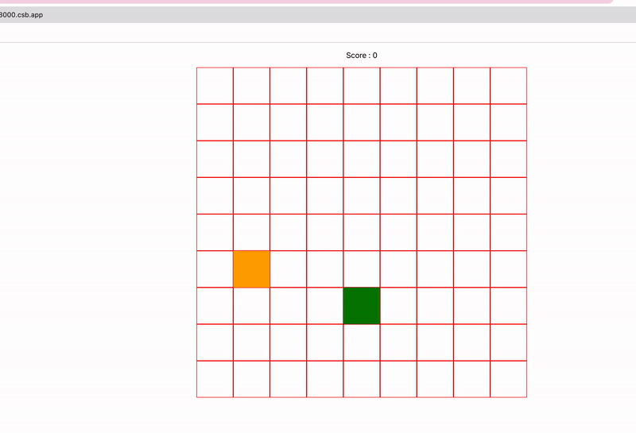

# 🐍 Snake Game

A classic Snake game built with **React JS**, using a **linked list** data structure to model the snake's body. Move the snake, eat the food, grow longer — but don't crash into the walls or yourself.

<p align="center">
  
</p>

## ✨ Features

- 🧠 **Linked list–based snake body** — each segment is a node, head and tail are tracked for O(1) movement and growth
- 🎯 Random food spawning with collision-safe placement
- 📊 Live score counter
- 💥 Wall and self-collision detection
- ⌨️ Smooth keyboard controls
- ⚛️ Built end-to-end in vanilla React (no game engine)

## 🧩 Why a Linked List?

A snake is the textbook use case for a singly linked list:

- **Move** → add a new head node, drop the tail node — O(1) on both ends
- **Grow** → just skip the tail removal step on the tick the snake eats food
- **Render** → traverse head → tail to draw each segment
- **Self-collision check** → walk the list and compare against the new head position

This avoids the cost of shifting an array every frame and makes the game logic map naturally to the data model.

## 🛠️ Tech Stack

- **React JS** (Create React App)
- **JavaScript (ES6+)**
- **HTML5 & CSS3**

## 🎮 Controls

| Key | Action       |
| --- | ------------ |
| ⬆️  | Move up      |
| ⬇️  | Move down    |
| ⬅️  | Move left    |
| ➡️  | Move right   |

## 🚀 Getting Started

### Prerequisites
- Node.js (v14 or higher)
- npm or yarn

### Installation

```bash
# Clone the repo
git clone https://github.com/shakthiGokul/snake.git
cd snake

# Install dependencies
npm install
# or
yarn install

# Start the dev server
npm start
# or
yarn start
```

Then open [http://localhost:3000](http://localhost:3000) in your browser.

### Build for Production

```bash
npm run build
```

## 📁 Project Structure

```
snake/
├── public/          # Static assets
├── src/             # React components & game logic
│   ├── components/  # UI components
│   └── utils/       # Linked list and game helpers
├── assets/          # Demo media
└── package.json
```

## 🧠 What I Learned

- Mapping a classic data structure (linked list) onto a real-world game loop
- Managing game state and ticks inside React without re-render thrashing
- Keyboard event handling and direction-change debouncing
- Collision detection and bounds checking

## 👤 Author

**Shakthi Gokul VP**
- GitHub: [@shakthiGokul](https://github.com/shakthiGokul)

## 📝 License

This project is open source and available for learning purposes.

---

*Built as a fun side project to explore data structures in a React app* 🎉